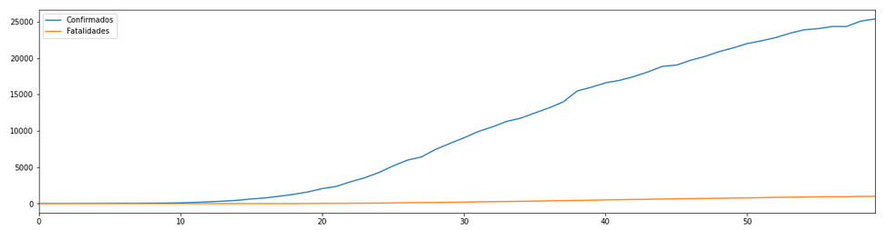
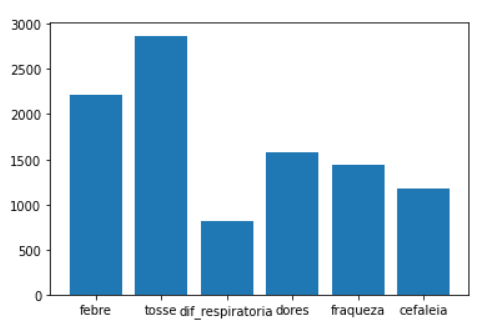
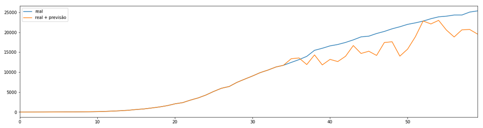

# AA 2019-2020

## Datasets

- [Kaggle - Covid-19 global forecasting competition](https://www.kaggle.com/c/covid19-global-forecasting-week-4)
- [Kaggle - Dados demográficos de países](https://www.kaggle.com/dumbgeek/countries-dataset-2020)
- [GitHub - Dados mundiais sobre Covid-19](https://github.com/CSSEGISandData/COVID-19)
- [GitHub - Dados sobre Covid-19 em Portugal](https://github.com/jgrocha/covid-pt)

## Objetivos

Neste projeto pretende-se:
- prever o numero de pessoas infetadas com o Covid-19;
- prever o numero de fatalidades devido ao Covid-19;
- Identificar fatores relevantes para as previsões anteriores.

## Sumario

Inicialmente é feito uma analise ao dataset com a serie temporal da expansão do Covid-19 pelo mundo, como por exemplo, comparar a progressão na China com a Nigeria.

De seguida, o foco passa a ser Portugal. Com a ajuda do dataset referido acima, são construídos gráficos e tabelas que demonstram a situação atual.

Por forma a tornar a previsão mais simples, foi preciso reduzir o número de features relevantes. Logo à partida percebe-se que o numero de confirmados é importante. Foi também executado um isolamento no dataset, separando por faixas etárias (Jovens, Idade Media e Terceira Idade), tirando conclusões com o dados obtidos.

De seguida, é preparado e analisado os dados sobre os sintomas, concluindo que a tosse é o maior sintoma.

Para melhor previsões, foi introduzido o conceito de **lags**, sendo usado logo de seguida.

Para a primeira previsão foi usado um regressão linear, obtendo as seguintes previsões:

## Grupo
- Marco Dantas, A81736
- Luís Macedo, A80494