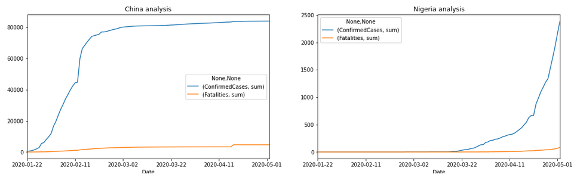

# AA 2019-2020

## Índice

- [Contituição do Grupo](#Contituição-do-Grupo)
- [Datasets](#Datasets)
  - [Publico](#Publico)
  - [Customizados](#Customizados)
- [Dependências](#Dependências)
- [Organização do repositório](#Organização-do-repositório)
- [Objetivos](#Objetivos)
- [Sumario](#Sumario)
- [Pequena demonstração de cada Dataset](#Pequena-demonstração-de-cada-Dataset)
  - [GitHub - Dados mundiais sobre Covid-19](#GitHub---Dados-mundiais-sobre-Covid-19)
  - [GitHub - Dados sobre Covid-19 em Portugal](#GitHub---Dados-sobre-Covid-19-em-Portugal)
  - [portugal_group_dataset.csv](#portugal_group_dataset.csv)
  - [modified_dataset.csv](#modified_dataset.csv)

## Contituição do Grupo
- Marco Dantas, A81736
- Luís Macedo, A80494

## Datasets

### Publico

- [GitHub - Dados mundiais sobre Covid-19](https://github.com/owid/covid-19-data)
- [GitHub - Dados sobre Covid-19 em Portugal](https://github.com/dssg-pt/covid19pt-data)

### Customizados

- [Dados com os input relevantes](https://github.com/FallenFoil/AA2-2019-20/blob/master/data/modified_dataset.csv)
- [Dados com confirmados e óbitos de Portugal e outros países parecidos](https://github.com/FallenFoil/AA2-2019-20/blob/master/data/portugal_group_dataset.csv)

## Dependências

- numpy
- pandas
- matplotlib
- intertools
- sklearn
- seaborn
- math
- keras
- tensorflow

## Organização do repositório

- **data**: ficheiros csv gerados;
- **AA2-Covid-19-Parte I**:
  - Exploração dos dados
  - Otimização dos atributos de *input*;
- **AA2-Covid-19-Parte II**:
  - Uso de métodos tradicionais de *Machine Learning*;
- **AA2-Covid-19-Parte III**:
  - Agrupamento de dados de países semelhantes a Portugal;
- **AA2-Covid-19-Parte IV**:
  - Uso de *Deep Learning*(*LSTM*);

## Objetivos

Neste projeto pretende-se:
- prever o numero de pessoas infetadas com o Covid-19;
- prever o numero de fatalidades devido ao Covid-19;
- Identificar fatores relevantes para as previsões anteriores.

## Sumario

Inicialmente é feito uma analise ao dataset com a serie temporal da expansão do Covid-19 pelo mundo, como por exemplo, comparar a progressão na China com a Nigeria.

De seguida, o foco passa a ser Portugal. Com a ajuda do dataset referido acima, são construídos gráficos e tabelas que demonstram a situação atual.

Por forma a tornar a previsão mais simples, foi preciso reduzir o número de features relevantes. Logo à partida percebe-se que o numero de confirmados é importante. Foi também executado um isolamento no dataset, separando por faixas etárias (Jovens, Idade Media e Terceira Idade), tirando conclusões com o dados obtidos.

De seguida, é preparado e analisado os dados sobre os sintomas, concluindo que a tosse é o maior sintoma.

Para melhor previsões, foi introduzido o conceito de **lags**, sendo usado logo de seguida.

Para a primeira previsão foi usado um regressão linear, obtendo as seguintes previsões:

## Pequena demonstração de cada Dataset

### GitHub - Dados mundiais sobre Covid-19

| iso_code | continent | location | date | total_cases | new_cases | total_deaths | new_deaths | total_cases_per_million | new_cases_per_million | total_deaths_per_million | new_deaths_per_million | total_tests | new_tests | total_tests_per_thousand | new_tests_per_thousand | new_tests_smoothed | new_tests_smoothed_per_thousand | tests_units | stringency_index | population | population_density | median_age | aged_65_older | aged_70_older | gdp_per_capita | extreme_poverty | cvd_death_rate | diabetes_prevalence | female_smokers | male_smokers | handwashing_facilities | hospital_beds_per_thousand | life_expectancy |
| --- | --- | --- | --- | --- | --- | --- | --- | --- | --- | --- | --- | --- | --- | --- | --- | --- | --- | --- | --- | --- | --- | --- | --- | --- | --- | --- | --- | --- | --- | --- | --- | --- | --- |
PRT | Europe | Portugal | 2020-06-21 | 38841.0 | 377.0 | 1528.0 | 1.0 | 3809.171 | 36.973 | 149.852 | 0.098 | --- | --- | --- | --- | --- | --- | --- | --- | 10196707.0 | 112.371 | 46.2 | 21.502 | 14.924 | 27936.896 | 0.5 | 127.842 | 9.85 | 16.3 | 30.0 |  | 3.39 | 82.05 |
PRT | Europe | Portugal | 2020-06-22 | 39133.0 | 292.0 | 1530.0 | 2.0 | 3837.808 | 28.637 | 150.048 | 0.196 | --- | --- | --- | --- | --- | --- | --- | --- | 10196707.0 | 112.371 | 46.2 | 21.502 | 14.924 | 27936.896 | 0.5 | 127.842 | 9.85 | 16.3 | 30.0 |  | 3.39 | 82.05 |
PRT | Europe | Portugal | 2020-06-23 | 39392.0 | 259.0 | 1534.0 | 4.0 | 3863.208 | 25.4 | 150.441 | 0.392   | --- | --- | --- | --- | --- | --- | --- | --- | 10196707.0 | 112.371 | 46.2 | 21.502 | 14.924 | 27936.896 | 0.5 | 127.842 | 9.85 | 16.3 | 30.0 |  | 3.39 | 82.05 |
PRT | Europe | Portugal | 2020-06-24 | 39737.0 | 345.0 | 1540.0 | 6.0 | 3897.042 | 33.834 | 151.029 | 0.588 | --- | --- | --- | --- | --- | --- | --- | --- | 10196707.0 | 112.371 | 46.2 | 21.502 | 14.924 | 27936.896 | 0.5 | 127.842 | 9.85 | 16.3 | 30.0 |  | 3.39 | 82.05 |

### GitHub - Dados sobre Covid-19 em Portugal

| data | data_dados | confirmados | confirmados_arsnorte | confirmados_arscentro | confirmados_arslvt | confirmados_arsalentejo | confirmados_arsalgarve | confirmados_acores | confirmados_madeira | confirmados_estrangeiro | confirmados_novos | recuperados | obitos | internados | internados_uci | lab | suspeitos | vigilancia | n_confirmados | cadeias_transmissao | transmissao_importada | confirmados_0_9_f | confirmados_0_9_m | confirmados_10_19_f | confirmados_10_19_m | confirmados_20_29_f | confirmados_20_29_m | confirmados_30_39_f | confirmados_30_39_m | confirmados_40_49_f | confirmados_40_49_m | confirmados_50_59_f | confirmados_50_59_m | confirmados_60_69_f | confirmados_60_69_m | confirmados_70_79_f | confirmados_70_79_m | confirmados_80_plus_f | confirmados_80_plus_m | sintomas_tosse | sintomas_febre | sintomas_dificuldade_respiratoria | sintomas_cefaleia | sintomas_dores_musculares | sintomas_fraqueza_generalizada | confirmados_f | confirmados_m | obitos_arsnorte | obitos_arscentro | obitos_arslvt | obitos_arsalentejo | obitos_arsalgarve | obitos_acores | obitos_madeira | obitos_estrangeiro | recuperados_arsnorte | recuperados_arscentro | recuperados_arslvt | recuperados_arsalentejo | recuperados_arsalgarve | recuperados_acores | recuperados_madeira | recuperados_estrangeiro | obitos_0_9_f | obitos_0_9_m | obitos_10_19_f | obitos_10_19_m | obitos_20_29_f | obitos_20_29_m | obitos_30_39_f | obitos_30_39_m | obitos_40_49_f | obitos_40_49_m | obitos_50_59_f | obitos_50_59_m | obitos_60_69_f | obitos_60_69_m | obitos_70_79_f | obitos_70_79_m | obitos_80_plus_f | obitos_80_plus_m | obitos_f | obitos_m | confirmados_desconhecidos_m | confirmados_desconhecidos_f |
| --- | --- | --- | --- | --- | --- | --- | --- | --- | --- | --- | --- | --- | --- | --- | --- | --- | --- | --- | --- | --- | --- | --- | --- | --- | --- | --- | --- | --- | --- | --- | --- | --- | --- | --- | --- | --- | --- | --- | --- | --- | --- | --- | --- | --- | --- | --- | --- | --- | --- | --- | --- | --- | --- | --- | --- | --- | --- | --- | --- | --- | --- | --- | --- | --- | --- | --- | --- | --- | --- | --- | --- | --- | --- | --- | --- | --- | --- | --- | --- | --- | --- | --- | --- | --- | --- |
| 22-06-2020 | 22-06-2020 00:00 | 39392 | 17320 | 4005 | 16926 | 376 | 529 | 144 | 92 |  | 259 | 25548 | 1534 | 424 | 72 | 1782 | 364305 | 30956.0 | 323131 |  | 767 | 491 | 561 | 827 | 695 | 3046 | 2611 | 3289 | 2911 | 3697 | 2900 | 3685 | 2614 | 2199 | 1920 | 1530 | 1365 | 3395 | 1625 | 0.38 | 0.28 | 0.11 | 0.2 | 0.21 | 0.15 | 22173 | 17219 | 814 | 248 | 440 | 2 | 15 | 15 | 0 | --- | --- | --- | --- | --- | --- | --- | --- | --- | 0 | 0 | 0 | 0 | 1 | 1 | 1 | 0 | 7 | 10 | 15 | 34 | 44 | 94 | 118 | 178 | 585 | 446 | 771 | 763 | 17 | 14 |
| 23-06-2020 | 23-06-2020 00:00 | 39737 | 17329 | 4014 | 17225 | 397 | 536 | 144 | 92 |  | 345 | 25829 | 1540 | 441 | 72 | 1759 | 366777 | 30248.0 | 325281 |  | 767 | 501 | 568 | 839 | 711 | 3080 | 2644 | 3323 | 2946 | 3731 | 2928 | 3706 | 2639 | 2216 | 1929 | 1535 | 1372 | 3411 | 1630 | 0.38 | 0.29 | 0.11 | 0.2 | 0.21 | 0.15 | 22353 | 17384 | 814 | 248 | 446 | 2 | 15 | 15 | 0 | --- | --- | --- | --- | --- | --- | --- | --- | --- | 0 | 0 | 0 | 0 | 1 | 1 | 1 | 0 | 7 | 10 | 15 | 34 | 45 | 95 | 119 | 179 | 587 | 446 | 775 | 765 | 17 | 11 |
| 24-06-2020 | 24-06-2020 00:00 | 40104 | 17339 | 4042 | 17527 | 406 | 552 | 146 | 92 |  | 367 | 26083 | 1543 | 429 | 73 | 1586 | 368967 | 30935.0 | 327277 |  | 767 | 509 | 581 | 846 | 723 | 3112 | 2678 | 3359 | 2970 | 3763 | 2957 | 3724 | 2665 | 2234 | 1945 | 1552 | 1387 | 3428 | 1641 | 0.37 | 0.28 | 0.1 | 0.2 | 0.21 | 0.15 | 22540 | 17564 | 814 | 248 | 449 | 2 | 15 | 15 | 0  | --- | --- | --- | --- | --- | --- | --- | --- | --- | 0 | 0 | 0 | 0 | 1 | 1 | 1 | 1 | 8 | 10 | 15 | 34 | 46 | 95 | 119 | 179 | 587 | 446 | 777 | 766 | 17 | 13 |

### portugal_group_dataset.csv

|   | location | new_cases_per_million | new_deaths_per_million |
|---|----------|-----------------------|------------------------|
| 0 | Austria  | 1.3319999999999999    | 0.0                    |
| 1 | Austria  | 3.6639999999999997    | 0.0                    |
| 2 | Austria  | 2.7760000000000002    | 0.0                    |
| 3 | Austria  | 0.33299999999999996   | 0.0                    |

### modified_dataset.csv

|  | confirmados_novos | internados | internados_uci | lab | vigilancia | obitos_novos | suspeitos_novos | lab_lag_1 | lab_lag_2 | suspeitos_novos_lag_1 | suspeitos_novos_lag_2 | suspeitos_novos_lag_3 | suspeitos_novos_lag_4 | suspeitos_novos_lag_5 | suspeitos_novos_lag_6 | suspeitos_novos_lag_7 | suspeitos_novos_lag_8 | vigilancia_lag_1 | vigilancia_lag_2 | vigilancia_lag_3 | vigilancia_lag_4 | vigilancia_lag_5 | vigilancia_lag_6 | vigilancia_lag_7 | vigilancia_lag_8 | obitos_novos_lag_1 | obitos_novos_lag_2 | obitos_novos_lag_3 | obitos_novos_lag_4 | obitos_novos_lag_5 | obitos_novos_lag_6 | obitos_novos_lag_7 | obitos_novos_lag_8 | confirmados_novos_lag_1 | confirmados_novos_lag_2 | confirmados_novos_lag_3 | confirmados_novos_lag_4 | confirmados_novos_lag_5 | confirmados_novos_lag_6 | confirmados_novos_lag_7 | confirmados_novos_lag_8 | obitos_novos_trend_15 | obitos_novos_trend_16 | obitos_novos_trend_17 | obitos_novos_trend_18 | obitos_novos_trend_19 | obitos_novos_trend_20 | obitos_novos_trend_21 | obitos_novos_trend_22 | obitos_novos_trend_23 | obitos_novos_trend_24 | obitos_novos_trend_25 | obitos_novos_trend_26 | obitos_novos_trend_27 | obitos_novos_trend_28 | obitos_novos_trend_29 | obitos_novos_trend_30 | obitos_novos_trend_31 | confirmados_novos_trend_15 | confirmados_novos_trend_16 | confirmados_novos_trend_17 | confirmados_novos_trend_18 | confirmados_novos_trend_19 | confirmados_novos_trend_20 | confirmados_novos_trend_21 | confirmados_novos_trend_22 | confirmados_novos_trend_23 | confirmados_novos_trend_24 | confirmados_novos_trend_25 | confirmados_novos_trend_26 | confirmados_novos_trend_27 | confirmados_novos_trend_28 | confirmados_novos_trend_29 | confirmados_novos_trend_30 | confirmados_novos_trend_31 |
| --- | --- | --- | --- | --- | --- | --- | --- | --- | --- | --- | --- | --- | --- | --- | --- | --- | --- | --- | --- | --- | --- | --- | --- | --- | --- | --- | --- | --- | --- | --- | --- | --- | --- | --- | --- | --- | --- | --- | --- | --- | --- | --- | --- | --- | --- | --- | --- | --- | --- | --- | --- | --- | --- | --- | --- | --- | --- | --- | --- | --- | --- | --- | --- | --- | --- | --- | --- | --- | --- | --- | --- | --- | --- | --- | --- |
| 111 | 292 | 407.0 | 69.0 | 1826.0 | 30855.0 | 2.0 | 1285.0 | 1771.0 | 1530.0 | 2269.0 | 2288.0 | 2084.0 | 2029.0 | 2121.0 | 1060.0 | 1160.0 | 2134.0 | 30852.0 | 29046.0 | 30426.0 | 30289.0 | 30810.0 | 30703.0 | 30658.0 | 30655.0 | 1.0 | 3.0 | 1.0 | 1.0 | 2.0 | 3.0 | 5.0 | 7.0 | 377 | 375 | 417 | 336 | 300 | 346 | 227 | 283 | -0.7777777777777778 | -0.8 | -0.75 | -0.8181818181818182 | -0.8333333333333334 | -0.8571428571428571 | -0.8571428571428571 | -0.8461538461538461 | -0.8571428571428571 | -0.8461538461538461 | -0.8571428571428571 | -0.8333333333333334 | -0.8571428571428571 | -0.8571428571428571 | -0.8461538461538461 | -0.8333333333333334 | -0.8571428571428571 | -0.2356020942408377 | -0.22546419098143236 | -0.11782477341389729 | -0.20218579234972678 | 0.49743589743589745 | 0.46 | -0.016835016835016835 | 0.13618677042801555 | -0.1657142857142857 | -0.039473684210526314 | 0.02456140350877193 | 0.3333333333333333 | 0.7696969696969697 | 0.9210526315789473 | 0.07749077490774908 | 0.013888888888888888 | 0.15873015873015872 |
| 112 | 259 | 424.0 | 72.0 | 1782.0 | 30956.0 | 4.0 | 1172.0 | 1826.0 | 1771.0 | 1285.0 | 2269.0 | 2288.0 | 2084.0 | 2029.0 | 2121.0 | 1060.0 | 1160.0 | 30855.0 | 30852.0 | 29046.0 | 30426.0 | 30289.0 | 30810.0 | 30703.0 | 30658.0 | 2.0 | 1.0 | 3.0 | 1.0 | 1.0 | 2.0 | 3.0 | 5.0 | 292 | 377 | 375 | 417 | 336 | 300 | 346 | 227 | -0.2 | -0.5555555555555556 | -0.6 | -0.5 | -0.6363636363636364 | -0.6666666666666666 | -0.7142857142857143 | -0.7142857142857143 | -0.6923076923076923 | -0.7142857142857143 | -0.6923076923076923 | -0.7142857142857143 | -0.6666666666666666 | -0.7142857142857143 | -0.7142857142857143 | -0.6923076923076923 | -0.6666666666666666 | -0.24269005847953215 | -0.3219895287958115 | -0.3129973474801061 | -0.2175226586102719 | -0.2923497267759563 | 0.3282051282051282 | 0.295 | -0.12794612794612795 | 0.007782101167315175 | -0.26 | -0.14802631578947367 | -0.0912280701754386 | 0.182648401826484 | 0.5696969696969697 | 0.7039473684210527 | -0.04428044280442804 | -0.10069444444444445 |
| 113 | 345 | 441.0 | 72.0 | 1759.0 | 30248.0 | 6.0 | 2472.0 | 1782.0 | 1826.0 | 1172.0 | 1285.0 | 2269.0 | 2288.0 | 2084.0 | 2029.0 | 2121.0 | 1060.0 | 30956.0 | 30855.0 | 30852.0 | 29046.0 | 30426.0 | 30289.0 | 30810.0 | 30703.0 | 4.0 | 2.0 | 1.0 | 3.0 | 1.0 | 1.0 | 2.0 | 3.0 | 259 | 292 | 377 | 375 | 417 | 336 | 300 | 346 | 0.0 | 0.2 | -0.3333333333333333 | -0.4 | -0.25 | -0.45454545454545453 | -0.5 | -0.5714285714285714 | -0.5714285714285714 | -0.5384615384615384 | -0.5714285714285714 | -0.5384615384615384 | -0.5714285714285714 | -0.5 | -0.5714285714285714 | -0.5714285714285714 | -0.5384615384615384 | 0.796875 | 0.008771929824561403 | -0.0968586387434555 | -0.08488063660477453 | 0.04229607250755287 | -0.05737704918032787 | 0.7692307692307693 | 0.725 | 0.16161616161616163 | 0.3424124513618677 | -0.014285714285714285 | 0.13486842105263158 | 0.21052631578947367 | 0.5753424657534246 | 1.0909090909090908 | 1.269736842105263 | 0.2730627306273063 |
